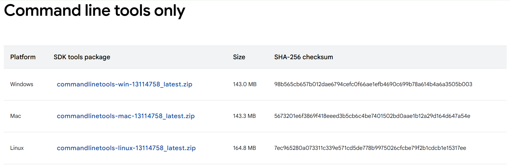
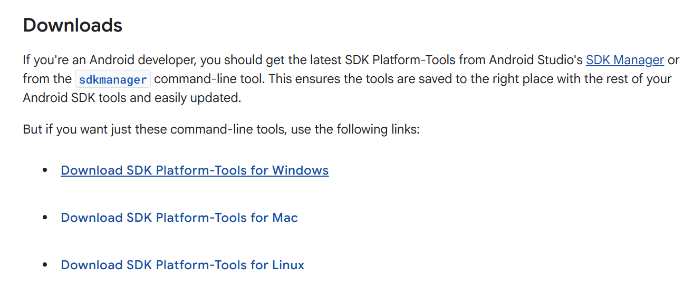
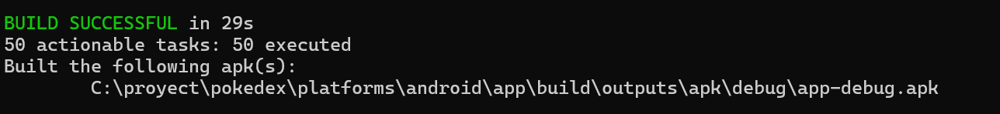

# Ayudantía 6: Creación de una APK con Apache Cordova

En esta ayudantía veremos cómo **crear una aplicación móvil (APK)** utilizando **[Apache Cordova](https://cordova.apache.org/)**.
Cordova es un **framework de desarrollo móvil multiplataforma** de código abierto que permite construir aplicaciones usando tecnologías web estándar como **HTML5**, **CSS3** y **JavaScript**.

Las aplicaciones desarrolladas con Cordova se ejecutan dentro de un contenedor nativo específico para cada plataforma, lo que facilita su despliegue en distintos sistemas operativos móviles sin reescribir el código base.


## Requisitos previos

Requiere tener las siguientes tecnologías instaladas previamente:

* **Node.js** ≥ 16.13.0
* **npm** ≥ 8.19.4

---

## Paso 1: Instalar la herramienta CLI de Cordova

Escribe el siguiente comando en la terminal:

```bash
npm install -g cordova
```

Para verificar la instalación:

```bash
cordova -v
```

---

## Paso 2: Crear un proyecto Cordova

Dirígete al directorio donde deseas crear tu proyecto Cordova y, en la terminal, ejecuta el siguiente comando:

```bash
cordova create <PATH> [ID] [NAME]
```

Donde:

* **PATH:** Ruta donde quieres crear el proyecto.
* **ID:** Identificador con formato de dominio inverso.
* **NAME:** Nombre legible de la aplicación.

Ejemplo:

```bash
cordova create myapp com.example.myapp MyApp
```

Se generará una nueva carpeta llamada `myapp` y dentro tendrás el proyecto Cordova.

---

## Paso 3: Modificar proyecto en blanco

El paso anterior creó un proyecto en blanco. Ahora debes agregar tus archivos HTML, CSS y JS al proyecto.
Puedes modificar el archivo `index.html`, pero **NO** cambies su nombre.
Para más información, revisa el proyecto de ejemplo de la ayudantía.

---

## Paso 4: Añadir la plataforma Android al proyecto

Para crear la APK del proyecto necesitarás primero instalar varias dependencias, como **Gradle**, **Android SDK**, **Java JDK** y **Android target**.

Debes tener cuidado con las versiones de cada dependencia. En la **[guía oficial de Android Platform](https://cordova.apache.org/docs/en/12.x-2025.01/guide/platforms/android/index.html)** encontrarás las versiones de Android soportadas por tu versión de Cordova.

Para los siguientes pasos se instalarán las dependencias necesarias para **cordova-android 13.0.0** (revisar `package.json`).

---

### Paso 4.1: Instalar JDK 17

* Descarga e instala el Java Development Kit 17: [https://www.oracle.com/java/technologies/javase/jdk17-archive-downloads.html](https://www.oracle.com/java/technologies/javase/jdk17-archive-downloads.html)
* Crea una variable de entorno llamada `JAVA_HOME` (en mi caso, JDK 17 se instaló en: `C:\Program Files\Java\jdk-17`).
* Agrega la variable al PATH escribiendo: `%JAVA_HOME%\bin`
* Comprueba que se agregó correctamente al PATH ejecutando en la terminal:

```bash
java -version
```

**JAVA_HOME:**


**Variable PATH:**


---

### Paso 4.2: Instalar Android SDK

* Descarga **Command Line Tools** para Windows: [https://developer.android.com/studio?hl=es-419](https://developer.android.com/studio?hl=es-419)
* Descarga **SDK Platform Tools**: [https://developer.android.com/tools/releases/platform-tools](https://developer.android.com/tools/releases/platform-tools)
* Crea la carpeta `C:\Android`
* Extrae ambos `.zip` y copia los archivos dentro de `C:\Android`.
* Dentro de `cmdline-tools`, crea una carpeta llamada `latest` y pega los archivos ahí.
* Crea una variable de entorno llamada `ANDROID_HOME` con `C:\Android`.
* Agrega al PATH:

  ```
  %ANDROID_HOME%\cmdline-tools\latest\bin
  %ANDROID_HOME%\platform-tools
  ```
* Luego, ve al directorio `C:\Android\cmdline-tools\latest\bin` y ejecuta:

```bash
sdkmanager "platform-tools" "platforms;android-34" "build-tools;30.0.3" "build-tools;35.0.0"
```

Command Lines Tools: 



Android Platform (SDK): 



---

### Paso 4.3: Instalar Gradle

* Descarga Gradle: [https://gradle.org/releases/#8.13](https://gradle.org/releases/#8.13)
* Crea la carpeta `C:\Gradle`
* Copia la carpeta `gradle-8.13` dentro de `C:\Gradle`
* Crea una variable de entorno llamada `GRADLE_HOME` con valor `C:\Gradle`
* Agrega al PATH:

  ```
  %GRADLE_HOME%\bin
  ```

---

### Paso 4.4: Agregar una plataforma Android al proyecto Cordova

* Escribe el comando en el proyecto:

```bash
cordova platform add android@13.0.0
```

* Verifica los requerimientos con:
```bash
cordova requirements
````
Si falta una dependencia, revisa los pasos anteriores e instálala.
* Compila el proyecto con:

```bash
cordova build android
```

* Si aparece el mensaje:
  `The operation completed successfully. '\\?\C:`
  significa que el directorio tiene espacios o caracteres especiales. Te recomiendo hacerlo en un path más corto.

Si todo sale bien, verás un mensaje similar a este:




## Notas:
- Revisar `cordova requirements` y `cordova build android` por cmd, en vez de VS code.

La APK podrás enviarlo por google drive y ver como funciona tu APK en tu celular.

Referencia de la ayudantía: https://youtu.be/tyMwVqLNAQ8?si=fERdnY8gwhAy6Tfn
